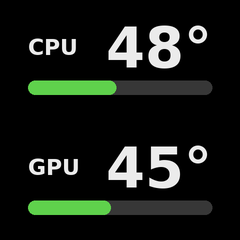

# kraken-lcd-monitor

Personal automation script: shows live CPU/GPU temperatures on the LCD of an
NZXT Kraken cooler, similar in style to NZXT CAM's temperature gauges.

This is **not** part of liquidctl itself — it's a standalone script that uses
liquidctl as a library and is meant to run continuously (as a systemd
service), rendering a new frame every couple of seconds with
[Pillow](https://python-pillow.org/) and pushing it to the screen with the
existing `set_screen("lcd", "static", ...)` driver API. No changes to the
liquidctl driver are needed.

Tested against the NZXT Kraken 2024 Plus (240x240 LCD) on a **Steam Deck /
SteamOS desktop with an AMD GPU**, with liquidctl running inside a
[distrobox](https://distrobox.it/) container. It should also work on other
LCD-capable Krakens and other Linux systems, but this README documents the
exact SteamOS + distrobox setup that is actually in use.



> **Important:** this branch (`personal/kraken-lcd-monitor`) has the fix for
> Kraken 2024 Plus static LCD images (from `fix-908-kraken-2024-plus-lcd-static`)
> merged on top of `main`. That fix is **not** on PyPI yet, so liquidctl must
> be installed **editable from this checkout**, never with a plain
> `pip install liquidctl`.

---

## How it works (the big picture)

- **liquidctl lives inside a distrobox container** (SteamOS's base system is
  immutable, so you can't `pip install` into it). The container shares your
  home directory with the host, so paths under `/home/<user>` are identical on
  both sides.
- **systemd is not available inside the container**, so the service runs on
  the **host** as a *user* service and uses `distrobox enter` to execute the
  script inside the container.
- USB access to the Kraken works from inside the container because distrobox
  shares `/dev` with the host.

```
host (SteamOS, systemd)                container (distrobox "liquictl-box")
────────────────────────               ────────────────────────────────────
systemd --user service      ── enter ──▶  venv python + liquidctl (with fix)
  kraken-lcd-monitor                        └─ reads sensors, renders frame,
                                               pushes it to the Kraken LCD
```

---

## Reinstall from scratch (e.g. after a format)

These are the complete steps to get everything working again from nothing.
Adjust the names in angle brackets. In this setup they are:

- username: `deck`
- distrobox container: `liquictl-box`
- repo checkout: `~/Developer/liquidctl`
- venv: `~/kraken-lcd-monitor/venv`
- your fork URL: `git@github.com:krupupakku/liquidctl.git`

### 1. Install distrobox and create the container (on the HOST)

If distrobox isn't installed yet on SteamOS, install it (it's commonly shipped
or available via the [official installer](https://distrobox.it/#installation)),
then create an Arch container:

```
distrobox create --name liquictl-box --image archlinux:latest
distrobox enter liquictl-box
```

### 2. Inside the container: system deps

```
# inside the container
sudo pacman -Syu --needed python python-pip git base-devel
```

Set up udev rules so the Kraken is accessible without root. From the repo
(cloned in the next step) you can use the helper in
[`extra/linux`](../../linux) (`71-liquidctl.rules` /
`generate-uaccess-udev-rules.py`). udev rules must be installed on the **host**
(they govern the real devices): copy the rules file to `/etc/udev/rules.d/` on
the host and reload with
`sudo udevadm control --reload && sudo udevadm trigger`.

### 3. Clone this branch (shared home, so visible from host and container)

```
git clone -b personal/kraken-lcd-monitor git@github.com:krupupakku/liquidctl.git ~/Developer/liquidctl
```

### 4. Create the venv and install liquidctl (editable) + deps

Run this **inside the container** (the venv must use the container's Python):

```
python3 -m venv ~/kraken-lcd-monitor/venv
~/kraken-lcd-monitor/venv/bin/pip install -e ~/Developer/liquidctl psutil
```

`pillow` is pulled in automatically as a liquidctl dependency.

Verify the venv is using the **fixed** liquidctl (must print a path containing
`Developer/liquidctl` and `True`):

```
~/kraken-lcd-monitor/venv/bin/python3 -c "import liquidctl.driver.kraken3 as k; print(k.__file__); print('_uses_simple_lcd_protocol' in open(k.__file__).read())"
```

### 5. Sanity-check sensors and try a manual run (inside the container)

```
~/kraken-lcd-monitor/venv/bin/python3 ~/Developer/liquidctl/extra/contrib/kraken-lcd-monitor/kraken_lcd_monitor.py --list-sensors
~/kraken-lcd-monitor/venv/bin/python3 ~/Developer/liquidctl/extra/contrib/kraken-lcd-monitor/kraken_lcd_monitor.py --match kraken -v
```

On this machine the auto-detected sensors are `k10temp.tctl` (CPU) and
`amdgpu.junction` (GPU).  On systems with both a discrete GPU and an APU
(both exposing `amdgpu` hwmon entries), `junction` is preferred because it
is only present on discrete GPUs — this avoids accidentally monitoring the
APU.  If yours differ, pass them explicitly with
`--cpu-sensor <chip.label> --gpu-sensor <chip.label>`, and use
`--list-sensors` to see all available keys.

### 6. Install the systemd USER service (on the HOST)

`exit` the container first, then, on the host:

```
command -v distrobox   # confirm the path; the unit assumes /usr/bin/distrobox
mkdir -p ~/.config/systemd/user
cp ~/Developer/liquidctl/extra/contrib/kraken-lcd-monitor/systemd/kraken-lcd-monitor.distrobox.service ~/.config/systemd/user/kraken-lcd-monitor.service
```

If your username, container name, checkout path or `distrobox` path differ
from the ones above, edit
[`systemd/kraken-lcd-monitor.distrobox.service`](systemd/kraken-lcd-monitor.distrobox.service)
accordingly before/after copying it.

Enable start-at-boot (without needing an interactive login) and start it:

```
loginctl enable-linger "$USER"
systemctl --user daemon-reload
systemctl --user enable --now kraken-lcd-monitor
systemctl --user status kraken-lcd-monitor
```

`status` should show `active (running)` and the LCD should start updating.
Reboot once to confirm it comes up automatically.

---

## Day-to-day operation

All commands run on the **host** (the service is a *user* service, so **no
`sudo`**, and always with `--user`):

| Action | Command |
| --- | --- |
| Start now + enable at boot | `systemctl --user enable --now kraken-lcd-monitor` |
| Stop (until next boot) | `systemctl --user stop kraken-lcd-monitor` |
| Disable (stop + don't start at boot) | `systemctl --user disable --now kraken-lcd-monitor` |
| Restart | `systemctl --user restart kraken-lcd-monitor` |
| Status | `systemctl --user status kraken-lcd-monitor` |
| Live logs | `journalctl --user -u kraken-lcd-monitor -f` |
| Clear a `failed` state | `systemctl --user reset-failed kraken-lcd-monitor` |

Stopping the service does **not** clear the screen by itself — the Kraken keeps
showing the last static frame. The unit's `ExecStopPost=` automatically runs
`liquidctl ... set lcd screen liquid` on a manual stop to restore the stock
animated liquid-temperature display. To do it manually from inside the
container:

```
liquidctl --match kraken set lcd screen liquid
```

### Updating the code later

Because the unit runs the script directly from the checkout and liquidctl is
installed editable, updating is just:

```
git -C ~/Developer/liquidctl pull
# only if the .service file itself changed:
cp ~/Developer/liquidctl/extra/contrib/kraken-lcd-monitor/systemd/kraken-lcd-monitor.distrobox.service ~/.config/systemd/user/kraken-lcd-monitor.service
systemctl --user daemon-reload
systemctl --user restart kraken-lcd-monitor
```

---

## Troubleshooting

Problems we actually hit while setting this up, and their fixes.

**`System has not been booted with systemd as init system (PID 1). Can't operate.`**
You're running `systemctl` *inside the container*. systemd is only on the host
— run all `systemctl --user` commands after `exit`ing the container.

**Service fails instantly, log says `multiple matching devices found, narrow down with --match/--pick`**
The command is missing a device filter. The `ExecStart` must include
`--match kraken` (multiple liquidctl devices are present, so the script refuses
to guess). This is already set in the shipped unit.

**Errors as if the 2024 Plus fix isn't there / `AssertionError: missing messages`**
The venv is using the wrong liquidctl (PyPI, or a non-editable copy). Reinstall
editable into the *service* venv and re-verify:
```
~/kraken-lcd-monitor/venv/bin/pip install -e ~/Developer/liquidctl
~/kraken-lcd-monitor/venv/bin/python3 -c "import liquidctl.driver.kraken3 as k; print(k.__file__)"
```
The printed path must be inside `~/Developer/liquidctl`, not `site-packages`.
Note: a plain `AssertionError: missing messages` can also happen if the broadcast
queue fills up, but the script already drains it before each update; if it
still happens, increase `--interval`.

**Very slow shutdown after enabling the service**
Caused by `ExecStopPost` (the liquid-restore via `distrobox enter`) hanging
while podman/the container is tearing down at poweroff. The shipped unit wraps
it in `timeout 8`, marks it non-fatal (`-`), and sets `TimeoutStopSec=12s`, so
it can no longer stall shutdown. If you edited the unit, make sure those are
present.

**`distrobox enter` path is different**
The unit hardcodes `/usr/bin/distrobox`. Check `command -v distrobox` on the
host and update the two `ExecStart`/`ExecStopPost` lines if it differs.

**The LCD is stuck on the last temperature frame**
Restore the default screen manually (from inside the container):
`liquidctl --match kraken set lcd screen liquid`.

**GPU temperature seems wrong (too low / matches CPU rather than the GPU)**
If you have both a discrete GPU and an APU with integrated graphics, both
register under the `amdgpu` hwmon chip name.  The script now auto-detects
`amdgpu.junction` first (only present on discrete GPUs) to avoid this;
however, if your discrete GPU doesn't expose `junction`, run
`--list-sensors` and pass the correct key explicitly with `--gpu-sensor`.
Duplicate labels are automatically suffixed (`amdgpu.edge#2`, etc.) so
every sensor has a unique key.

---

## Tuning

- `--interval <seconds>` (default `2`): how often to refresh. Each `static`
  update on the Kraken 2024 Plus involves a small LCD handshake plus a 240x240
  frame sent twice over USB; 2s is a safe starting point. By default a frame is
  only re-rendered/re-sent when the rounded CPU or GPU temperature changes
  (to reduce USB writes), so the real cost is low — pass `--force` to always
  resend every interval.
- `--warn-temp`, `--crit-temp`, `--scale-max`: color thresholds
  (green/yellow/red) and the temperature that corresponds to a full bar.
- `--font <path>`: use a specific `.ttf`/`.otf` instead of the auto-detected
  system font.

## Command-line reference

See `kraken_lcd_monitor.py --help` for the full list of options. Device
filtering flags (`--match`/`--pick`/`--vendor`/`--product`/...) follow the
same conventions as the liquidctl CLI and the other scripts in
[`extra/`](../..).

## Files

- [`kraken_lcd_monitor.py`](kraken_lcd_monitor.py) — the script.
- [`systemd/kraken-lcd-monitor.distrobox.service`](systemd/kraken-lcd-monitor.distrobox.service)
  — host user unit for the distrobox setup (the one in use).
- [`systemd/kraken-lcd-monitor.service`](systemd/kraken-lcd-monitor.service)
  — plain host system unit, for a non-container install (liquidctl installed
  directly on the host). Not used in the SteamOS + distrobox setup.
